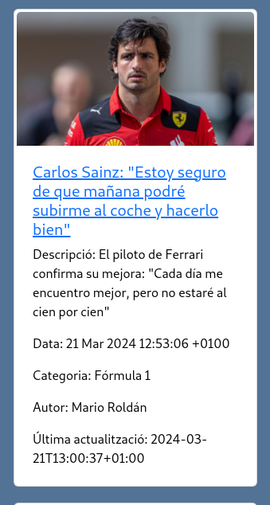
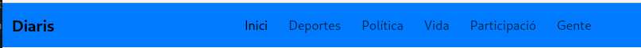

# Tecnologias
>Flask: Framework web de Python utilizado para construir la aplicación.
>Bootstrap: Framework CSS que facilita la creación de interfaces web responsivas y modernas.
>Feedparser: Librería Python utilizada para parsear feeds RSS 
### index.html:
- Navbar: Barra de navegación con enlaces a diferentes secciones del sitio (Inici, Deportes, Política, Vida, Participació, Gente).
- Carousel: Carrusel de Bootstrap que muestra imágenes destacadas.
### lavanguardia.html:
- Navbar: Similar a la de index.html, pero con un título específico para "La Vanguardia".
- RSS Feed Display: Muestra artículos del feed RSS de "La Vanguardia" utilizando tarjetas de Bootstrap. Cada tarjeta incluye la imagen, título, descripción, fecha, categoría, autor y última actualización del artículo.


### Se genera el cuerpo de la tarjeta (card-body) que contiene la informacion de los xml descargado de la vanguaridia:

- Un enlace al artículo original ({{item.link}}) con el título de la noticia ({{item.title}}).

- Descripción de la noticia ({{item.description}}).

- Fecha de publicación ({{item.published}}).

- Categoría de la noticia ({{item.category}}).

- Autor de la noticia ({{item.author}}).

- Fecha de la última actualización ({{item.modified}}).



## Bootstrap
- Uso de bootstap
```` 
    <link href="https://cdn.jsdelivr.net/npm/bootstrap@5.3.3/dist/css/bootstrap.min.css" rel="stylesheet">
    <script src="https://cdn.jsdelivr.net/npm/bootstrap@5.3.3/dist/js/bootstrap.bundle.min.js"></script>
````
#### Navbar
- Utilización de la clase `.navbar` para la barra de navegación.
- Implementación del botón de hamburguesa con la clase `.navbar-toggler`.
- Alineación del contenido en la barra de navegación mediante clases de flexbox y alineación.



#### Tarjetas (Cards)
- Presentación de cada noticia dentro de una tarjeta de Bootstrap con la clase `.card`.
- Utilización de la clase `.card-img-top` para la imagen superior de cada tarjeta.
- Aplicación de estilos personalizados para las tarjetas, incluyendo transiciones y efectos al pasar el cursor sobre ellas.

#### Rejilla (Grid)
- Empleo del sistema de rejilla de Bootstrap para organizar las tarjetas en filas y columnas para organizar las noticias de la vanguardia.
- Utilización de clases de tamaño de columna (`col-lg-3 col-md-6 col-sm-12 mb-1 pb-3`, etc.) para controlar el diseño responsivo de las tarjetas en diferentes tamaños de pantalla pasando de 4 a 2 y de 2 a 1. Y dejando un espaciado inferior entre las tarjetas.

### Carousel
-  Carrusel de Bootstrap que muestra imágenes destacadas.


